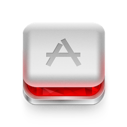

<!SLIDE subsection>
# The Client #

## RubyMotion
[http://rubymotion.com/](http://rubymotion.com/)

<!SLIDE smaller>
# What is RubyMotion? #

> "RubyMotion is a revolutionary toolchain that lets you quickly develop and test native iOS and OS X applications for iPhone, iPad and Mac, all using the awesome Ruby language you know and love." - [rubymotion.com](http://www.rubymotion.com)

## Ceremony vs Essence ##

> "code that is unrelated to the task at hand. This code is immediate deadweight, and often vastly outweighs the code that is actually getting work done. Many forms of ceremony come from unnecessary special cases or limitations at the language level" - Stuart Halloway - [Ending Legacy Code In Our Lifetime](http://thinkrelevance.com/blog/2008/04/01/ending-legacy-code-in-our-lifetime)

<!SLIDE bullets incremental>
# What RubyMotion is NOT #

* Not free ($199/year)
* Not open source, but parts of the tool chain are.
* Not cross-platform.  iOS and OS X only
* Not replacement for understanding iOS SDK, MVC, etc.

<!SLIDE smallest>
# Obj-C Ceremony #

    @@@ cpp
    //  PokeViewController.h
    #import <UIKit/UIKit.h>

    @interface PokeViewController : UIViewController

    @property IBOutlet UILabel* pokeLabel;
    @property IBOutlet UILabel* identifierLabel;

    -(IBAction) poke;

    @end

    // PokeViewController.m
    #import "PokeViewController.h"

    @interface PokeViewController ()
    @end

    @implementation PokeViewController

    - (void)viewDidLoad
    {
      // Do something
    }

    - (void) poke
    {
      // Do something
    }

    @end

<!SLIDE smaller>
# Ruby Essence #

    @@@ ruby
    class PokeViewController < UIViewController
      extend IB

      outlet :pokeLabel
      outlet :identifierLabel

      def viewDidLoad
        # do something
      end

      def poke
        # do something
      end
    end
