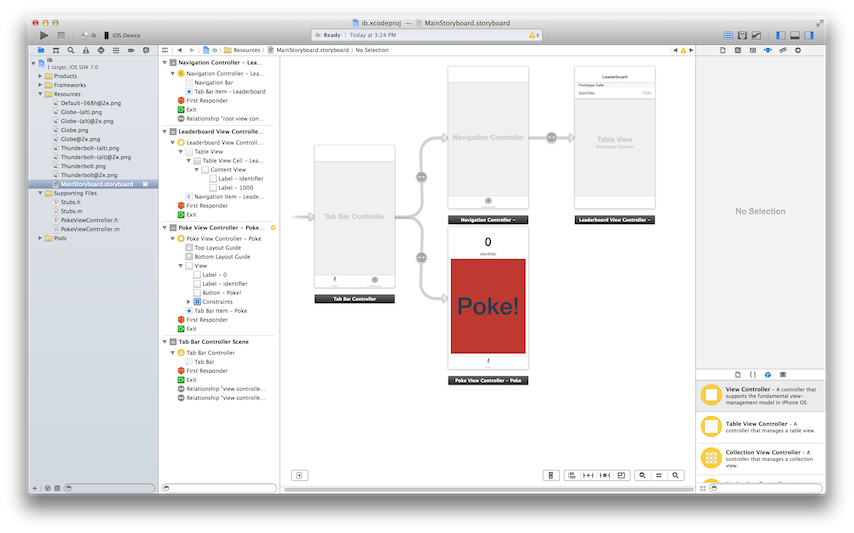
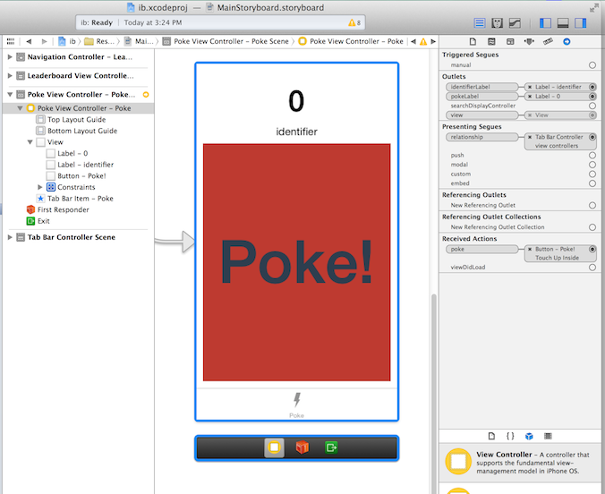

<!SLIDE commandline incremental>
# Create Project #

    $ motion create PokeR
    Create PokeR
    Create PokeR/.gitignore
    Create PokeR/app/app_delegate.rb
    Create PokeR/Gemfile
    Create PokeR/Rakefile
    Create PokeR/resources/Default-568h@2x.png
    Create PokeR/spec/main_spec.rb

<!SLIDE commandline>
# Build the UI #

    $ more Gemfile
    source 'https://rubygems.org'

    gem 'rake'
    gem 'ib'

    $ rake ib:open

Create the storyboard

<!SLIDE smallest>
# Add Some ViewController Classes #

    @@@ ruby
    # app/poke_view_controller.rb
    class PokeViewController < UIViewController
      extend IB

      outlet :pokeLabel
      outlet :identifierLabel

      def viewDidLoad
      end

      def poke
      end
    end

    # app/leaderboard_view_controller.rb
    class LeaderboardViewController < UITableViewController
      def viewDidLoad
      end

      def viewDidAppear(animated)
      end

      def tableView(tableView, numberOfRowsInSection:section)
        0 # need to replace with actual number of leaders
      end

      def tableView(tableView, cellForRowAtIndexPath:indexPath)
        # need a cell here
      end
    end

<!SLIDE smaller>
# Hook up the UI #

    $ rake ib:open

<!SLIDE smallest>
# Getting Storyboards working in RubyMotion #

    @@@ ruby
    # Rakefile
    # -*- coding: utf-8 -*-
    $:.unshift("/Library/RubyMotion/lib")
    require 'motion/project/template/ios'

    begin
      require 'bundler'
      Bundler.require
    rescue LoadError
    end

    Motion::Project::App.setup do |app|
      # Use `rake config' to see complete project settings.
      app.name = 'PokeR'

      app.info_plist['UIMainStoryboardFile'] = 'MainStoryboard'
    end

    # app/app_delegate.rb
    class AppDelegate
      def application(application, didFinishLaunchingWithOptions:launchOptions)
        true
      end

      def window
        @window
      end

      def setWindow(window)
        @window = window
      end
    end
