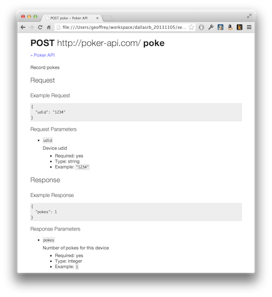

<!SLIDE incremental smaller>
# Adding API Documentation and Validation #

 

fdoc is short for Farnsdocs, named for everybody's favorite, good news-bearing, crotchety old man, Professor Farnsworth.

<!SLIDE commandline smaller incremental>
# Configuring RSpec and fdoc

    $ more Gemfile

    source 'https://rubygems.org'
    ruby '2.0.0'

    gem 'grape'

    ...

    group :development, :test do
      gem 'fdoc', :git => 'git@github.com:square/fdoc.git'
      gem 'json-schema', '< 2.0.0' # temporarily avoid change in json-schema require syntax
    end

    $ more spec_helper.rb

    ENV["RACK_ENV"] ||= 'test'
    require 'rubygems'
    require 'bundler/setup'
    Bundler.require :default, ENV['RACK_ENV']
    require './poker'

    require 'fdoc/spec_watcher'
    Fdoc.service_path = File.expand_path(File.dirname(__FILE__) + "/fdoc")
    Fdoc.decide_success_with do |response, status|
      status.to_i < 400
    end

    RSpec.configure do |config|
      config.include Rack::Test::Methods
      config.include JsonSpec::Helpers
      config.include Fdoc::SpecWatcher
      ...
    end

<!SLIDE bullets incremental smaller>
# Chicken or the Egg? #

    @@@ ruby
    # poker_spec.rb
    require './spec_helper'

    describe Poker::API do
      ...

      describe 'POST /poke', :fdoc => 'poke' do
        ...
      end
      ...
    end

* Should we generate our fdocs by hand based on our knowledge of the API requests and responses?
* OR
* Should we allow fdoc to scaffold the initial fdocs based on the specs?

<!SLIDE commandline incremental small>
# Scaffolding fdoc #

    $ FDOC_SCAFFOLD=true rspec poker_spec.rb
    ....

    Finished in 0.09356 seconds
    4 examples, 0 failures

    $ ls -l fdoc/
    -rw-r--r--  1 geoffrey  staff   45 Nov  1 14:30 ???.fdoc.service
    -rw-r--r--  1 geoffrey  staff  393 Nov  1 14:30 poke-POST.fdoc

<!SLIDE smaller>
# Filling in the Details #

    @@@ javascript
    # fdoc/poke-POST.fdoc
    ---
    description: Record pokes
    responseCodes:
    - status: 500
      successful: false
      description: "Not identified"
    - status: 201
      successful: true
      description: "Poke recorded"
    requestParameters:
      properties:
        udid:
          description: "Device udid"
          required: true
          type: string
          example: '1234'
    responseParameters:
      properties:
        pokes:
          description: "Number of pokes for this device"
          required: true
          type: integer
          example: 1

<!SLIDE commandline small incremental>
# Generating Documentation and Running Specs #

    $ fdoc convert ./fdoc -o doc
              Converting fdoc to html
       using  ./fdoc
      inside  /Users/geoffrey/workspace/dallasrb_20131105/server/doc
      create  styles.css
      create  index.html
      create  poke-POST.html

    $ open doc/index.html

    $ rspec poker_spec.rb
    ....

    Finished in 0.09356 seconds
    4 examples, 0 failures

